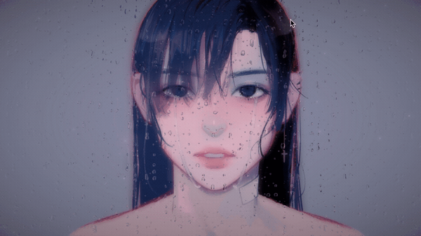
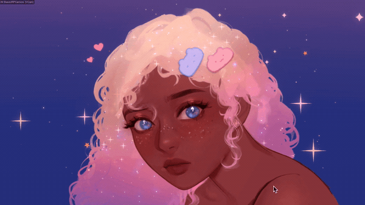
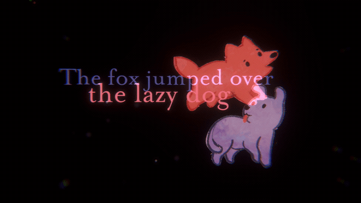

# 2D Unity 2020 Graphic Experiments

Includes 7 different experiments involving Unity's latest packages.

# Description

Below I'll describe what each scene does uniquely.

Most scenes have a "camera follows mouse position" feature.

## Dynamically Flowing Hair & Petals

- Hair and petals flow naturally, as if in wind
- Uses 2D animation bones / particle system, and Effector2Ds and WindZone
  

## Light Beams

- Light beams from eyes follow mouse
- Light beams simulated with cylinder with a removed face and a special material
  

## Rain Shader

- Create rain effect with shader given RenderTexture (inspired by this [ShaderToy](https://www.shadertoy.com/view/ltffzl) by [The Art Of Code](https://www.youtube.com/watch?v=uiF5Tlw22PI))
  

## Galaxy Anime

- Reproduced shaky "eye shine" effect in anime.
- Reflected background galaxy in eyes and hair with RenderTexture & ShaderGraph
  

## Bloody Rain Particles

- Blood flows from nose; red rain particles
  

## Wiggly Text with Blend Mode

- Text wiggles and has additive blend mode using custom TMP shader; other sprites have blend modes
- Utilizes the [Blend command](https://docs.unity3d.com/Manual/SL-Blend.html)
  

## Blurry, Shaky Typewriting

- Camera shakes and blurs sporadically; text tweens scale, opacity, and typewrites
- Shake and blur done via Cinemachine's Noise property and dynamically setting Depth-Of-Field
  

# Requirements

Requires the following packages -

Unity Packages:

- 2D Animation
- Cinemachine
- Input System
- Lightweight RP
- Post Processing
- Shader Graph
- TextMeshPro
- Unity UI
- Universal RP

Asset Store:

- DOTween

Already has the following packages included -

- [CharTweener](https://github.com/mdechatech/CharTweener)

# Licensing

## Code

All scripts, shaders, and scene files are distributed under the [MIT license](LICENSE.md).

## Assets

All art assets are under exclusive copyright; they'll be used for future games. If they're used/sold, I will find you 👀
